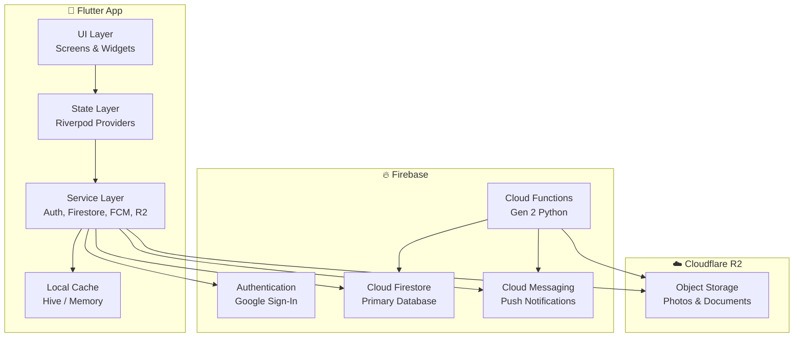

# ARCHITECTURE.md — System Design

> Pet Companion — Flutter + Firebase + Cloudflare R2

## System Overview



## Flutter App Architecture

```
mobile/lib/
├── main.dart
├── firebase_options.dart
├── core/
│   ├── theme/                  # App theme, colors, typography
│   ├── constants/              # App-wide constants
│   ├── routing/                # GoRouter configuration
│   ├── utils/                  # Image compression, date helpers, PDF generation
│   └── widgets/                # Shared widgets (photo picker, loading, etc.)
├── features/
│   ├── auth/                   # Google Sign-In, auth state
│   │   ├── screens/
│   │   ├── providers/
│   │   └── services/
│   ├── pets/                   # Pet CRUD, pet profiles
│   │   ├── models/
│   │   ├── screens/
│   │   ├── providers/
│   │   └── services/
│   ├── family/                 # Family management, invitations, roles
│   │   ├── models/
│   │   ├── screens/
│   │   ├── providers/
│   │   └── services/
│   ├── journal/                # Pet journal entries (mood, symptoms, notes, etc.)
│   │   ├── models/
│   │   ├── screens/
│   │   ├── providers/
│   │   └── services/
│   ├── health/                 # Weight tracking, medical records, vaccinations
│   │   ├── models/
│   │   ├── screens/
│   │   ├── providers/
│   │   └── services/
│   ├── schedule/               # Events, cyclic events, reminders, routines
│   │   ├── models/
│   │   ├── screens/
│   │   ├── providers/
│   │   └── services/
│   ├── notifications/          # FCM handling, notification preferences
│   │   ├── providers/
│   │   └── services/
│   ├── expenses/               # Expense tracking
│   │   ├── models/
│   │   ├── screens/
│   │   ├── providers/
│   │   └── services/
│   ├── contacts/               # Pet service contacts
│   │   ├── models/
│   │   ├── screens/
│   │   ├── providers/
│   │   └── services/
│   ├── reports/                # PDF report generation
│   │   ├── screens/
│   │   ├── providers/
│   │   └── services/
│   └── premium/               # Premium subscription management
│       ├── screens/
│       ├── providers/
│       └── services/
└── services/
    ├── firebase_service.dart   # Firestore helpers
    ├── auth_service.dart       # Firebase Auth wrapper
    ├── storage_service.dart    # Cloudflare R2 client
    ├── notification_service.dart # FCM setup
    └── cache_service.dart      # Hive local cache
```

## Firebase Cloud Functions Structure

```
firebase/functions/
├── main.py                     # Entry point, function registration
├── requirements.txt
└── src/
    ├── auth/                   # User lifecycle (on_create, on_delete)
    ├── family/                 # Family management Cloud Functions
    ├── notifications/          # Notification dispatch logic
    ├── reports/                # PDF generation
    ├── premium/                # Subscription validation
    └── storage/                # R2 signed URL generation
```

---

## Cloud Firestore Database Schema

### Design Principles
1. **Denormalization over joins** — Firestore has no joins; duplicate data where read-heavy
2. **Subcollections for 1:N** — Journal entries, events, etc. live under their parent pet
3. **Composite indexes** — For time-range queries on journal/events
4. **Security rules** — Family-scoped access; users can only read/write their family's data
5. **Scalability** — Document size < 1MB, collection groups for cross-pet queries

---

### Collection: `users`
> One document per authenticated user.

**Path**: `/users/{userId}`

| Field | Type | Description |
|-------|------|-------------|
| `uid` | `string` | Firebase Auth UID (same as doc ID) |
| `email` | `string` | User email |
| `displayName` | `string` | Display name from Google |
| `photoUrl` | `string?` | Profile photo URL |
| `familyIds` | `array<string>` | List of family IDs the user belongs to |
| `fcmTokens` | `array<string>` | Device FCM tokens for push notifications |
| `isPremium` | `boolean` | Whether user has active premium subscription |
| `premiumExpiresAt` | `timestamp?` | Premium expiration date |
| `createdAt` | `timestamp` | Account creation time |
| `updatedAt` | `timestamp` | Last profile update |

**Subcollection**: `/users/{userId}/notificationPreferences/{familyId}`

| Field | Type | Description |
|-------|------|-------------|
| `familyId` | `string` | The family these preferences apply to |
| `mutedEventIds` | `array<string>` | Cyclic event IDs the user has muted |
| `enablePush` | `boolean` | Master push toggle for this family |
| `updatedAt` | `timestamp` | Last update |

---

### Collection: `families`
> A family is the collaboration unit. Pets belong to families.

**Path**: `/families/{familyId}`

| Field | Type | Description |
|-------|------|-------------|
| `name` | `string` | Family name |
| `familyCode` | `string` | Unique invite code (for join-by-code) |
| `hashedPassword` | `string` | Hashed password for code+password join |
| `adminIds` | `array<string>` | User IDs with admin role |
| `memberIds` | `array<string>` | All member user IDs (including admins) |
| `petIds` | `array<string>` | Pet IDs belonging to this family |
| `createdBy` | `string` | UID of family creator |
| `createdAt` | `timestamp` | Creation time |
| `updatedAt` | `timestamp` | Last update |

**Subcollection**: `/families/{familyId}/invitations/{invitationId}`

| Field | Type | Description |
|-------|------|-------------|
| `invitedEmail` | `string` | Email of the invited user |
| `invitedBy` | `string` | UID of the admin who sent invitation |
| `status` | `string` | `pending` / `accepted` / `declined` |
| `createdAt` | `timestamp` | When the invitation was sent |
| `expiresAt` | `timestamp` | Invitation expiration |

**Subcollection**: `/families/{familyId}/notificationSettings/{memberId}`
> Admin-controlled per-member notification settings

| Field | Type | Description |
|-------|------|-------------|
| `userId` | `string` | The member this setting applies to |
| `enabledEventTypes` | `array<string>` | Event types this member receives (`feeding`, `medication`, `walk`, etc.) |
| `enabledPetIds` | `array<string>` | Pet IDs this member receives notifications for |
| `updatedBy` | `string` | Admin who last updated |
| `updatedAt` | `timestamp` | Last update |

---

### Collection: `pets`
> Top-level collection for efficient collection group queries.

**Path**: `/pets/{petId}`

| Field | Type | Description |
|-------|------|-------------|
| `name` | `string` | Pet name |
| `species` | `string` | `dog`, `cat`, `bird`, `rabbit`, `fish`, `reptile`, `other` |
| `breed` | `string?` | Breed (optional) |
| `gender` | `string` | `male`, `female`, `unknown` |
| `dateOfBirth` | `timestamp?` | Date of birth (optional) |
| `photoUrl` | `string?` | Profile photo URL (Cloudflare R2) |
| `photoThumbnailUrl` | `string?` | Compressed thumbnail URL |
| `microchipId` | `string?` | Microchip number |
| `microchipRegistry` | `string?` | Registry name |
| `microchipContactInfo` | `string?` | Contact details for microchip |
| `currentWeight` | `number?` | Latest weight in kg |
| `familyId` | `string` | The family this pet belongs to (1 pet → 1 family) |
| `createdBy` | `string` | UID of creator |
| `createdAt` | `timestamp` | Creation time |
| `updatedAt` | `timestamp` | Last update |

---

### Subcollection: `pets/{petId}/journalEntries`
> The core timeline. All pet events flow into this collection.

**Path**: `/pets/{petId}/journalEntries/{entryId}`

| Field | Type | Description |
|-------|------|-------------|
| `type` | `string` | Entry type: `mood`, `symptom`, `appetite`, `energy`, `weight`, `behavior`, `note`, `medication`, `care_record`, `walk`, `grooming` |
| `timestamp` | `timestamp` | When this event occurred |
| `createdBy` | `string` | UID of the user who logged it |
| `createdByName` | `string` | Display name (denormalized for UI) |
| `notes` | `string?` | Free-form notes |
| `photoUrls` | `array<string>` | Attached photo URLs (Cloudflare R2) |
| `data` | `map` | Type-specific data (see below) |
| `createdAt` | `timestamp` | Document creation time |
| `updatedAt` | `timestamp` | Last update |

**`data` field structure by `type`:**

| Type | `data` Fields |
|------|---------------|
| `mood` | `{ mood: "happy"\|"sad"\|"anxious"\|"energetic"\|"calm", scale: 1-5 }` |
| `symptom` | `{ symptoms: ["vomiting","diarrhea","lethargy","coughing","sneezing","limping","other"], severity: "mild"\|"moderate"\|"severe" }` |
| `appetite` | `{ level: "ate_well"\|"ate_some"\|"didnt_eat", foodType: string?, amount: string? }` |
| `energy` | `{ level: "low"\|"normal"\|"high" }` |
| `weight` | `{ weightKg: number, unit: "kg"\|"lbs" }` |
| `behavior` | `{ incident: "barking"\|"jumping"\|"accidents"\|"aggression"\|"anxiety"\|"other", context: string? }` |
| `note` | `{}` (notes field is sufficient) |
| `medication` | `{ medicationName: string, dosage: string?, administered: boolean }` |
| `care_record` | `{ veterinarian: string?, clinic: string?, diagnosis: string?, treatment: string?, cost: number?, nextDueDate: timestamp?, documentUrls: array<string> }` |
| `walk` | `{ durationMinutes: number?, distanceKm: number? }` |
| `grooming` | `{ grooming_type: "bath"\|"nails"\|"brushing"\|"haircut"\|"other" }` |

---

### Subcollection: `pets/{petId}/weightHistory`
> Dedicated collection for weight chart queries (sorted by date).

**Path**: `/pets/{petId}/weightHistory/{entryId}`

| Field | Type | Description |
|-------|------|-------------|
| `weightKg` | `number` | Weight value |
| `unit` | `string` | `kg` or `lbs` |
| `date` | `timestamp` | Measurement date |
| `createdBy` | `string` | Who recorded it |
| `createdAt` | `timestamp` | Creation time |

---

### Subcollection: `pets/{petId}/medications`
> Active medication schedules for a pet.

**Path**: `/pets/{petId}/medications/{medicationId}`

| Field | Type | Description |
|-------|------|-------------|
| `name` | `string` | Medication name |
| `dosage` | `string` | Dosage instructions |
| `frequency` | `string` | `daily`, `twice_daily`, `weekly`, `as_needed` |
| `scheduledTimes` | `array<string>` | Times of day (e.g., `["08:00", "20:00"]`) |
| `startDate` | `timestamp` | When to start |
| `endDate` | `timestamp?` | When to end (null = ongoing) |
| `isActive` | `boolean` | Whether currently active |
| `createdBy` | `string` | UID |
| `createdAt` | `timestamp` | Creation time |
| `updatedAt` | `timestamp` | Last update |

**Subcollection**: `/pets/{petId}/medications/{medicationId}/logs/{logId}`

| Field | Type | Description |
|-------|------|-------------|
| `scheduledTime` | `timestamp` | When it was supposed to be given |
| `administeredAt` | `timestamp?` | When it was actually given (null = missed) |
| `administeredBy` | `string?` | UID of person who gave it |
| `status` | `string` | `given`, `missed`, `skipped` |
| `notes` | `string?` | Optional notes |

---

### Subcollection: `pets/{petId}/vaccinations`
> Vaccination records with reminder support.

**Path**: `/pets/{petId}/vaccinations/{vaccinationId}`

| Field | Type | Description |
|-------|------|-------------|
| `name` | `string` | Vaccine name |
| `dateAdministered` | `timestamp` | When given |
| `nextDueDate` | `timestamp?` | When next dose is due |
| `veterinarian` | `string?` | Vet who administered |
| `clinic` | `string?` | Clinic name |
| `batchNumber` | `string?` | Vaccine batch/lot number |
| `documentUrl` | `string?` | Photo/scan of vaccination certificate |
| `reminderSent` | `boolean` | Whether reminder was sent for next due |
| `createdBy` | `string` | UID |
| `createdAt` | `timestamp` | Creation time |

---

### Subcollection: `pets/{petId}/medicalRecords`
> Document storage for vet records, test results, etc.

**Path**: `/pets/{petId}/medicalRecords/{recordId}`

| Field | Type | Description |
|-------|------|-------------|
| `title` | `string` | Record title / description |
| `type` | `string` | `vet_visit`, `test_result`, `prescription`, `imaging`, `other` |
| `date` | `timestamp` | Date of the record |
| `veterinarian` | `string?` | Vet name |
| `clinic` | `string?` | Clinic name |
| `diagnosis` | `string?` | Diagnosis |
| `treatment` | `string?` | Treatment plan |
| `cost` | `number?` | Cost |
| `nextFollowUp` | `timestamp?` | Next appointment |
| `documentUrls` | `array<string>` | Uploaded document/photo URLs |
| `tags` | `array<string>` | Tags for organization (`dental`, `blood_work`, `xray`, etc.) |
| `notes` | `string?` | Additional notes |
| `createdBy` | `string` | UID |
| `createdAt` | `timestamp` | Creation time |

---

### Collection: `events`
> Top-level for cross-family queries and Cloud Function processing.

**Path**: `/events/{eventId}`

| Field | Type | Description |
|-------|------|-------------|
| `title` | `string` | Event title (e.g., "Morning Feeding") |
| `description` | `string?` | Details |
| `petId` | `string` | Which pet this is for |
| `familyId` | `string` | Which family |
| `type` | `string` | `feeding`, `medication`, `walk`, `grooming`, `vet_appointment`, `reminder`, `custom` |
| `isCyclic` | `boolean` | Whether this repeats |
| `schedule` | `map?` | Recurrence config (see below) |
| `oneTimeDate` | `timestamp?` | For non-cyclic events |
| `assignedTo` | `string?` | UID of assigned family member (null = all) |
| `createdBy` | `string` | UID |
| `createdAt` | `timestamp` | Creation time |
| `updatedAt` | `timestamp` | Last update |
| `isActive` | `boolean` | Whether the event is active |

**`schedule` map (for cyclic events):**

| Field | Type | Description |
|-------|------|-------------|
| `times` | `array<string>` | Times of day (`["08:00", "12:00", "18:00"]`) |
| `daysOfWeek` | `array<int>?` | 1=Mon..7=Sun (null = every day) |
| `intervalDays` | `int?` | Repeat every N days (alternative to daysOfWeek) |
| `startDate` | `timestamp` | When recurring starts |
| `endDate` | `timestamp?` | When recurring ends (null = forever) |

**Subcollection**: `/events/{eventId}/completions/{completionId}`
> Tracks each instance of a recurring event being completed.

| Field | Type | Description |
|-------|------|-------------|
| `scheduledAt` | `timestamp` | When it was scheduled |
| `completedAt` | `timestamp` | When it was completed |
| `completedBy` | `string` | UID of completer |
| `completedByName` | `string` | Display name (denormalized) |
| `notes` | `string?` | Optional notes |
| `medicationAdded` | `boolean?` | For feeding events: was medication mixed in? |

---

### Collection: `expenses`
> Top-level for reporting queries across families.

**Path**: `/expenses/{expenseId}`

| Field | Type | Description |
|-------|------|-------------|
| `petId` | `string` | Which pet |
| `familyId` | `string` | Which family |
| `category` | `string` | `food`, `vet`, `medication`, `toys`, `grooming`, `insurance`, `accessories`, `other` |
| `amount` | `number` | Cost amount |
| `currency` | `string` | Currency code (e.g., `PLN`, `USD`) |
| `description` | `string?` | What the expense was for |
| `date` | `timestamp` | Date of expense |
| `receiptUrl` | `string?` | Photo of receipt (Cloudflare R2) |
| `createdBy` | `string` | UID |
| `createdAt` | `timestamp` | Creation time |

---

### Collection: `contacts`
> Pet service contacts, scoped to family.

**Path**: `/contacts/{contactId}`

| Field | Type | Description |
|-------|------|-------------|
| `familyId` | `string` | Which family |
| `type` | `string` | `vet`, `emergency_vet`, `groomer`, `pet_sitter`, `trainer`, `pet_store`, `other` |
| `name` | `string` | Contact name or business name |
| `phone` | `string?` | Phone number |
| `email` | `string?` | Email address |
| `address` | `string?` | Physical address |
| `website` | `string?` | Website URL |
| `notes` | `string?` | Additional notes |
| `createdBy` | `string` | UID |
| `createdAt` | `timestamp` | Creation time |
| `updatedAt` | `timestamp` | Last update |

---

### Collection: `routineTemplates`
> Pre-made or custom daily routine checklists.

**Path**: `/routineTemplates/{templateId}`

| Field | Type | Description |
|-------|------|-------------|
| `familyId` | `string` | Which family |
| `petId` | `string?` | Specific pet (null = family-wide) |
| `name` | `string` | Template name (e.g., "Morning Routine") |
| `timeOfDay` | `string` | `morning`, `afternoon`, `evening`, `custom` |
| `tasks` | `array<map>` | Task list (see below) |
| `isActive` | `boolean` | Whether currently in use |
| `createdBy` | `string` | UID |
| `createdAt` | `timestamp` | Creation time |
| `updatedAt` | `timestamp` | Last update |

**`tasks` array item:**

| Field | Type | Description |
|-------|------|-------------|
| `id` | `string` | Unique task ID within template |
| `title` | `string` | Task description |
| `assignedTo` | `string?` | UID of assigned member |
| `order` | `int` | Sort order |

**Subcollection**: `/routineTemplates/{templateId}/dailyLogs/{dateString}`
> Daily completion tracking (dateString = "2026-02-27")

| Field | Type | Description |
|-------|------|-------------|
| `date` | `timestamp` | The date |
| `completedTasks` | `map<string, map>` | `{ taskId: { completedBy: uid, completedAt: timestamp } }` |

---

## Firestore Indexes

```json
{
  "indexes": [
    {
      "collectionGroup": "journalEntries",
      "queryScope": "COLLECTION",
      "fields": [
        { "fieldPath": "type", "order": "ASCENDING" },
        { "fieldPath": "timestamp", "order": "DESCENDING" }
      ]
    },
    {
      "collectionGroup": "journalEntries",
      "queryScope": "COLLECTION",
      "fields": [
        { "fieldPath": "timestamp", "order": "DESCENDING" }
      ]
    },
    {
      "collectionGroup": "events",
      "queryScope": "COLLECTION",
      "fields": [
        { "fieldPath": "familyId", "order": "ASCENDING" },
        { "fieldPath": "isActive", "order": "ASCENDING" },
        { "fieldPath": "oneTimeDate", "order": "ASCENDING" }
      ]
    },
    {
      "collectionGroup": "expenses",
      "queryScope": "COLLECTION",
      "fields": [
        { "fieldPath": "familyId", "order": "ASCENDING" },
        { "fieldPath": "date", "order": "DESCENDING" }
      ]
    },
    {
      "collectionGroup": "expenses",
      "queryScope": "COLLECTION",
      "fields": [
        { "fieldPath": "petId", "order": "ASCENDING" },
        { "fieldPath": "category", "order": "ASCENDING" },
        { "fieldPath": "date", "order": "DESCENDING" }
      ]
    },
    {
      "collectionGroup": "weightHistory",
      "queryScope": "COLLECTION",
      "fields": [
        { "fieldPath": "date", "order": "ASCENDING" }
      ]
    },
    {
      "collectionGroup": "completions",
      "queryScope": "COLLECTION",
      "fields": [
        { "fieldPath": "scheduledAt", "order": "DESCENDING" }
      ]
    },
    {
      "collectionGroup": "vaccinations",
      "queryScope": "COLLECTION",
      "fields": [
        { "fieldPath": "nextDueDate", "order": "ASCENDING" }
      ]
    }
  ]
}
```

---

## Firestore Security Rules (Summary)

```
rules_version = '2';
service cloud.firestore {
  match /databases/{database}/documents {

    // Users can only read/write their own profile
    match /users/{userId} {
      allow read, write: if request.auth.uid == userId;
    }

    // Family access: must be a member
    match /families/{familyId} {
      allow read: if request.auth.uid in resource.data.memberIds;
      allow create: if request.auth != null;
      allow update: if request.auth.uid in resource.data.adminIds;
    }

    // Pets: accessible by family members
    match /pets/{petId} {
      allow read: if isFamilyMember(resource.data.familyId);
      allow write: if isFamilyAdmin(resource.data.familyId);

      // All subcollections: family member access
      match /{subcollection=**} {
        allow read: if isFamilyMemberOfPet(petId);
        allow write: if isFamilyMemberOfPet(petId);
      }
    }

    // Events: family member access
    match /events/{eventId} {
      allow read: if isFamilyMember(resource.data.familyId);
      allow write: if isFamilyMember(resource.data.familyId);
      match /{subcollection=**} {
        allow read, write: if isFamilyMemberOfEvent(eventId);
      }
    }

    // Expenses: family member access
    match /expenses/{expenseId} {
      allow read: if isFamilyMember(resource.data.familyId);
      allow write: if isFamilyMember(resource.data.familyId);
    }

    // Contacts: family member access
    match /contacts/{contactId} {
      allow read: if isFamilyMember(resource.data.familyId);
      allow write: if isFamilyMember(resource.data.familyId);
    }

    // Routine templates: family member access
    match /routineTemplates/{templateId} {
      allow read: if isFamilyMember(resource.data.familyId);
      allow write: if isFamilyMember(resource.data.familyId);
      match /{subcollection=**} {
        allow read, write: if isFamilyMemberOfTemplate(templateId);
      }
    }
  }
}
```

---

## Cloudflare R2 Storage Structure

```
pet-companion-bucket/
├── users/{userId}/
│   └── profile/                    # User profile photos
├── pets/{petId}/
│   ├── profile/                    # Pet profile photos + thumbnails
│   ├── journal/{entryId}/          # Journal entry photos
│   └── medical/{recordId}/         # Medical documents and photos
└── expenses/{expenseId}/           # Receipt photos
```

**Upload Flow:**
1. Flutter app compresses photo (max 1024px, ~80% JPEG quality)
2. App requests signed upload URL from Cloud Function
3. App uploads directly to R2 via signed URL
4. App stores the resulting URL in Firestore document

---

## Cloud Functions (Gen 2 Python)

| Function | Trigger | Purpose |
|----------|---------|---------|
| `on_user_created` | Auth onCreate | Create user document in Firestore |
| `on_user_deleted` | Auth onDelete | Cleanup user data |
| `generate_r2_upload_url` | HTTPS callable | Generate signed upload URL for R2 |
| `generate_r2_download_url` | HTTPS callable | Generate signed download URL for R2 |
| `send_event_notification` | Firestore onCreate (completions) | Notify family when event is completed |
| `send_scheduled_notifications` | Cloud Scheduler | Cron job to send upcoming event reminders |
| `send_medication_reminders` | Cloud Scheduler | Cron job for medication dose reminders |
| `send_vaccination_reminders` | Cloud Scheduler | Cron job for upcoming vaccination due dates |
| `generate_pet_report` | HTTPS callable | Generate PDF health report |
| `process_family_invitation` | HTTPS callable | Handle family invite by email |
| `validate_premium_status` | HTTPS callable | Verify premium subscription status |
| `cleanup_expired_invitations` | Cloud Scheduler | Remove expired family invitations |

---

## Premium Feature Gating

| Feature | Free | Premium |
|---------|:----:|:-------:|
| Pets per family | 2 | Unlimited |
| Journal entries per month | 50 | Unlimited |
| Photo attachments per entry | 1 | 5 |
| PDF report generation | ❌ | ✅ |
| Expense tracking | Basic totals | Charts + export |
| Routine templates | 2 | Unlimited |
| Medical record storage | 10 docs | Unlimited |
| Family members | 3 | 10 |

> Premium is stored on the user document (`isPremium`, `premiumExpiresAt`) and validated both client-side (for UI gating) and server-side (via Cloud Functions for critical operations).
